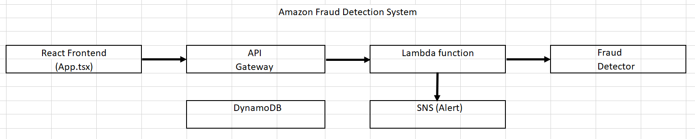

# fraud-detection-infra

High level Architecture Diagram

Program Structure Explanation
1. Frontend (App.tsx)
Purpose: Provides a user interface for submitting transaction details for fraud detection.

Key Features:

Form with inputs for Transaction ID, Customer ID, Amount, and IP Address

Submit button that sends data to the backend API

Displays the fraud detection result

Technologies: React, TypeScript, Axios for API calls

2. Lambda Functions
handler.py
Purpose: Handles fraud detection requests for registration events.

Key Features:

Receives email and IP address as input

Calls Amazon Fraud Detector API for prediction

Logs results to DynamoDB

Sends SNS alerts for fraudulent events

AWS Services Used: Fraud Detector, DynamoDB, SNS

main.py
Purpose: Handles fraud detection for financial transactions.

Key Features:

Receives transaction details (ID, customer, amount, IP)

Calls Fraud Detector with transaction variables

Stores results in DynamoDB

Triggers SNS alerts for fraud cases

AWS Services Used: Fraud Detector, DynamoDB, SNS

3. Infrastructure (Terraform)
main.tf
Purpose: Defines and provisions the AWS infrastructure.

Key Components:

SNS Topic for fraud alerts with email subscription

DynamoDB table for transaction storage

IAM role with permissions for Lambda

Lambda function configuration

AWS Services Provisioned: SNS, DynamoDB, IAM, Lambda

variables.tf
Purpose: Defines configurable variables for the Terraform deployment.

Key Variables:

AWS region

Alert email address

DynamoDB table name

Fraud Detector name

outputs.tf
Purpose: Outputs important resource information after deployment.

Outputs: SNS Topic ARN

4. Deployment Scripts
deploy.sh
Purpose: Automates the deployment process.

Steps:

Zips Lambda function code

Runs Terraform to provision infrastructure

setup-frauddetector.sh
Purpose: Configures Amazon Fraud Detector components.

Key Configurations:

Creates entity type (customer)

Defines variables (transactionId, customerId, amount, ipAddress)

Creates event type and outcomes (fraud/legit)

Sets up detector with rules (e.g., "amount > 5000")

Activates detector version

5. Fraud Detector Configuration
Entity Type: "customer"

Event Type: "transaction_event"

Variables:

transactionId (STRING)

customerId (STRING)

amount (FLOAT)

ipAddress (STRING)

Rule: Flags transactions over $5000 as potential fraud

Outcomes: "fraud" or "legit"

Workflow
User submits transaction details through React frontend

API Gateway receives the request and triggers Lambda function

Lambda function:

Sends transaction data to Fraud Detector

Receives fraud prediction outcome

Stores transaction and result in DynamoDB

Sends alert via SNS if fraud is detected

Result is returned to the frontend for display

Key AWS Services Integration
Amazon Fraud Detector: Core fraud detection service

Lambda: Serverless compute for business logic

API Gateway: Frontend-to-backend interface

DynamoDB: Transaction history storage

SNS: Fraud alert notifications

IAM: Security and permissions management

This architecture provides a scalable, serverless solution for real-time fraud detection with alerting and audit capabilities.