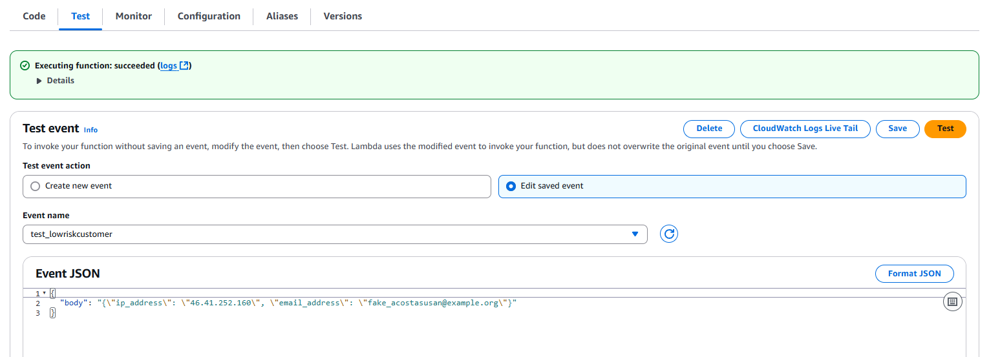

# fraud-detection-infra

<b> High level Architecture Diagram </b>

<b>Program Structure Explanation</b>

<b>1. Frontend (App.tsx) - optional </b>

<b>Purpose</b>: Provides a user interface for submitting transaction details for fraud detection.

<b>Key Features</b>:

Form with inputs for Transaction ID, Customer ID, Amount (Optional), and IP Address

Submit button that sends data to the backend API

Displays the fraud detection result

<b>Technologies</b>: React, TypeScript, Axios for API calls

<b> 2. Lambda Functions </b>

<b> 2.1 handler.py</b>

<b>Purpose</b>: Handles fraud detection requests for registration events.

<b>Key Features</b>:

Receives email and IP address as input

Calls Amazon Fraud Detector API for prediction

Logs results to DynamoDB

Sends SNS alerts for fraudulent events (including high risk)

<b>AWS Services Used</b>: Fraud Detector, DynamoDB, SNS

<b>2.2 main.py</b>

<b>Purpose</b>: Handles fraud detection for financial transactions.

<b>Key Features</b>:

Receives transaction details (ID, customer, amount, IP)

Calls Fraud Detector with transaction variables

Stores results in DynamoDB

Triggers SNS alerts for fraud cases

<b>AWS Services Used</b>: Fraud Detector, DynamoDB, SNS

<b>3. Infrastructure (Terraform)</b>

<b>3.1 main.tf</b>

<b>Purpose</b>: Defines and provisions the AWS infrastructure.

<b>Key Components</b>:

SNS Topic for fraud alerts with email subscription

DynamoDB table for transaction storage

IAM role with permissions for Lambda

Lambda function configuration

<b>AWS Services Provisioned</b>: SNS, DynamoDB, IAM, Lambda

<b>3.2 variables.tf</b>

Purpose: Defines configurable variables for the Terraform deployment.

Key Variables:

AWS region

Alert email address

DynamoDB table name

Fraud Detector name

<b>3.3 outputs.tf</b>

<b>Purpose</b>: Outputs important resource information after deployment.

<b>Outputs</b>: SNS Topic ARN

<b>4. Fraud Detector Configuration (manually configure in AWS console)</b>

Entity Type: "customer"

Event Type: "transaction_event"

Variables:

transactionId (STRING)

customerId (STRING)

ipAddress (STRING)

Outcomes: "fraud" or "legit" or high risk, low risk or medium risk customer for registration

<b>Workflow</b>

User submits transaction details through React frontend

API Gateway receives the request and triggers Lambda function

Lambda function:

Sends transaction data to Fraud Detector

Receives fraud prediction outcome

Stores transaction and result in DynamoDB

Sends alert via SNS if fraud is detected

Result is returned to the frontend for display

<b>Key AWS Services Integration</b>

<b>Amazon Fraud Detector</b>: Core fraud detection service

<b>Lambda</b>: Serverless compute for business logic

<b>API Gateway</b>: Frontend-to-backend interface

<b>DynamoDB</b>: Transaction history storage

<b>SNS</b>: Fraud alert notifications

<b>IAM</b>: Security and permissions management

This architecture provides a scalable, serverless solution for real-time fraud detection with alerting and audit capabilities.

<b>Test Method and Results</b> 
Step 1: write lambda/main.py   
Screenshot in AWS console for our input   

Step 2 upload zip to the AWS Lambda Console:
1.	Navigate to AWS Lambda Console: https://console.aws.amazon.com/lambda/home
2.	Find our Lambda function: it’s called fraud-checker based on our Terraform (function_name = "fraud-checker").
3.	Click on "Code" tab.
4.	Click "Upload from" → ".zip file" and upload fraud_predictor.zip.
5.	Click "Deploy" to apply the change.

Step 3 Test the Lambda Function (Manually)
In the same Lambda Console:
1.	Go to the “Test” tab.
2.	Click “Configure test event” (or "Create new test").
3.	Choose any name like TestEvent1.
4.	Use this as the test payload:
5.	Click “Test” button.

  

Step 4 Check the Result and Logs 
✅ Test Result: 
After clicking “Test”, we’ll see a response panel with something like: 
{ 
  "statusCode": 200, 
  "body": "{\"transactionId\": \"...\", \"outcome\": \"accept\"}" 
} 
Or 
{ 
  "statusCode": 500, 
  "body": "{\"error\": \"some error...\"}" 
} 

Logs: 
Scroll down in the same window to view Log output. We'll see: 
•	The input values 
•	Any errors if it failed 
•	The outcome (accept or fraud/high risk) 

Screenshot of test result

Step 5 Confirm It Worked  

•	✅ Fraud Detector: Ensure that our model is trained and active, with an event type named transaction_event and the 2 variables:
      ip_address and email_address 

•	✅ DynamoDB: Go to DynamoDB Console, open our table (e.g., fraud-transactions), check if a record was added. 

•	✅ SNS: If the prediction was fraud, check our email inbox (that we set in var.alert_email) for the alert. 

Step 5.1 Confirm It Worked: Fraud Detector active

Step 5.2 Confirm It Worked: dynomoDB  

1)	Open our Table  

•	Find our table in the list (example name: fraud-transactions or whatever you defined as DDB_TABLE).  

•	Click the table name.  

2) View the Data (Items)  

•	In the left sidebar, click "Explore table items".  

•	We’ll see a list of all the records (items) in our table.  

3)_Verify the Record  

•	Look for a new item with the transactionId, userId, or email used in our test.  

•	Confirm the fields like ip, email, outcome, and timestamp are correctly stored.  

  

We also can download the dynamodb table in csv format as seen by the screenshot below

Step 5.3 Confirm It Worked: SNS
In AWS, we seen our email status is confirmed

The value shown for SNS_TOPIC_ARN exactly matches the ARN of our SNS topic.

Below screenshot showing email received fraud_alert.

Step 5.4 Confirmed it work cloudwatch

<b> Key takeaways </b>

Here are the key takeaways from our fraud detection project using AWS services, Terraform, and Python:

 <b> Architecture & Components </b>  

•	Amazon Fraud Detector (AFD): Core engine for fraud prediction based on event variables (e.g., email, IP).

•	AWS Lambda: Orchestrates fraud prediction, stores results in DynamoDB, and triggers SNS alerts.

•	DynamoDB: Stores all transaction details and prediction outcomes.

•	SNS (Simple Notification Service): Sends alerts (e.g., email) for suspicious outcomes.

•	Terraform: Manages infrastructure-as-code, ensuring reproducibility and consistency across deployments.

✅ Technical Lessons Learned

1. Event Variable Setup Must Match AFD Expectations

   •	Variables like email_address and ip_address must match exactly (names and types) in both the Lambda code and the AFD event type configuration.

2. Strict ISO 8601 Format for Timestamps

  •	Timestamps passed to AFD must be in this format:

      ✅ '2025-06-01T08:47:13Z'

      ❌ '2025-06-01T08:47:13.715697+00:00'

3. SNS Subject Field Constraints

   Must be ASCII-only, ≤100 characters, and contain no emojis. Violating this throws an InvalidParameter error.

4. IAM Permissions Are Crucial

   Lambda must have:

	(1) sns:Publish permission for the SNS topic.

  (2) dynamodb:PutItem for storing predictions.

  (3) frauddetector:GetEventPrediction to call AFD.

  (4)	Terraform IAM roles/policies must be carefully constructed and attached to Lambda.

5. Lambda ZIP Deployment

•	Lambda code must be zipped with main.py at the root.

•	Always recompute source_code_hash in Terraform when updating code.

________________________________________
💡 Operational Insights

•	Logs are our friend: CloudWatch logs are vital to diagnose issues with Lambda execution or failed SNS calls.

•	Testing in Console: Lambda's test feature is great for simulating input and viewing real-time results. We should eventually connect to a frontend or event source.

•	SNS Email confirmation is mandatory before emails are delivered.

________________________________________
🧩 Potential Enhancements  

•	Add a frontend UI to submit real transaction data.

•	Visualize fraud patterns via Athena/QuickSight.

•	Implement retries for failed SNS or DynamoDB writes.

•	Use versioned Lambda deployments via Terraform alias.

________________________________________
**References**  

[1] “Credit Card Fraud Detection: A Realistic Modeling and a Novel Learning Strategy”, Andrea Dal Pozzolo, Giacomo Boracchi, Olivier Caelen, Cesare Alippi, Gianluca Bontemi, IEEE Transactions on Neural Networks and Learning Systems, Volume 29 Issue 8
https://ieeexplore.ieee.org/document/8038008  

[2] “A Survey of Credit Card Fraud Detection Techniques: Data and Technique Oriented Perspective”, SamanehSorournejad, Zahra Zojaji, Reza Ebrahimi Atani, Amir Hassan Monadjemi, 2016 
https://www.researchgate.net/publication/310610856_A_Survey_of_Credit_Card_Fraud_Detection_Techniques_Data_and_Technique_Oriented_Perspective  

[3] “Fraud Detection in Online Transactions Using Machine Learning”, Jashandeep Singh, Prabhjot Kaur, ResearchGate.  

https://www.researchgate.net/publication/376518057_Fraud_Detection_in_Online_Transactions_Using_Machine_Learning 

[4] “Deploying Machine Learning Models for Fraud Detection at Scale” 
https://www.uber.com/en-SG/blog/michelangelo-machine-learning-platform/  

[5] “Deploying Large-scale Fraud Detection Machine Learning Models at PayPal”, Quinn Zuo, 2021. 

https://medium.com/paypal-tech/machine-learning-model-ci-cd-and-shadow-platform-8c4f44998c78  

[6] “Using AI/ML to build a Fraud Detection Model”, Pradeep Loganathan, 2024  

https://pradeepl.com/blog/building-a-fraud-detection-model/  

[7] “Machine Learning for Fraud Detection: Best Models and Techniques”, SQream  

https://sqream.com/blog/machine-learning-for-fraud-detection/  

[8] AWS Fraud Detector Documentation  

https://aws.amazon.com/fraud-detector/  

https://docs.aws.amazon.com/frauddetector/  

https://docs.aws.amazon.com/frauddetector/latest/ug/how-frauddetector-works.html  

[9] AWS re:Invent 2020: Catch more potential online fraud faster with Amazon Fraud Detector, https://www.youtube.com/watch?v=5QSXbgbvleo  

[10] Proactively Detect and Prevent Online Fraud with Amazon SageMaker and Amazon Fraud Detector, by AWS. https://www.youtube.com/watch?v=viih7LpB1gg  

[11] AWS Summit London - Amazon SageMaker for Fraud Detection, Dr Steve Turner https://www.youtube.com/watch?v=wzwkLV9gDXk  

[12] AWS Machine Learning: Fraud Detection with Amazon SageMaker, Theodore Vasiloudis, https://www.youtube.com/watch?v=whPKYfXTtw4  

[13] AWS Machine Learning (SageMaker) Specialization https://www.youtube.com/watch?v=3XTmwgjO5DM&list=PLMWIyphKbqfwW4RmL1G29Q_7LOnUV-cE6  

[14] AWS Summit Singapore Livestream 2025, https://aws.amazon.com/events/summits/singapore/?aws-summit-asean.sort-by=item.additionalFields.ranking&aws-summit-asean.sort-order=asc&awsf.aws-summit-asean-track=*all&awsf.aws-summit-asean-level=*all&awsf.aws-summit-asean-session-type=*all&awsf.aws-summit-asean-topic=*all&awsf.aws-summit-asean-industry=*all&awsf.aws-summit-asean-audience=*all

[15] CertNexus Certified Artificial Intelligence Practitioner Professional Certificate, Coursera  

[16] Intro to Machine Learning featuring Generative AI, by freecodecamp.org

